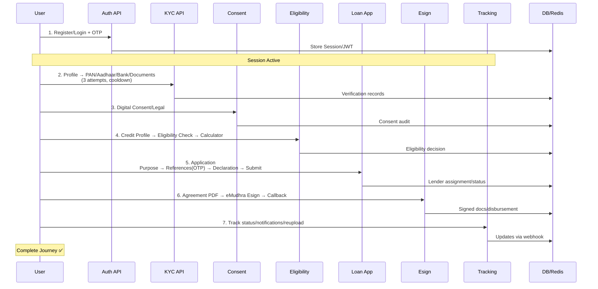

# LSP Project Architecture & End-to-End Workflow

## 🏗️ High-Level Architecture (Mermaid Diagram)

```mermaid
graph TB
    subgraph FastAPI_App['FastAPI App (main.py)']
        R[APIRouters]
    end
    
    DB[(PostgreSQL<br/>SQLAlchemy ORM)]
    Redis[(Redis<br/>OTP/Session)]
    
    subgraph Services['Services Layer']
        S[Business Logic]
    end
    
    subgraph Ext['External Services']
        T[Twilio SMS]
        K[Karza/Digilocker<br/>Cashfree/Hyperverge]
        E[eMudhra Esign]
        N[NBFC Webhooks]
    end
    
    R --> S
    S --> DB
    S --> Redis
    S --> Ext
    
    classDef app fill:#e1f5fe
    classDef db fill:#f3e5f5
    classDef ext fill:#e8f5e8
    class FastAPI_App app
    class DB,Redis db
    class Ext ext
```

## 🔄 Layered Architecture
| Layer | Directories | Responsibility |
|-------|-------------|----------------|
| **Presentation** | `routers/` | API endpoints, input validation |
| **Application** | `services/` | Orchestration, business rules |
| **Domain** | `models/`, `schemas/` | Entities, DTOs, validation |
| **Infrastructure** | `repositories/`, `core/`, `providers/` | DB access, external APIs, config |
| **Cross-cutting** | `utils/`, `core/dependencies.py` | Auth, logging, security |

## 📊 Key Components

### Database Models (60+ tables)
```
Auth: User, Lender, UserSession, OTPVerification
KYC: UserProfile, DocumentUpload, KYC PAN/Aadhaar/Bank, AttemptTracker
Consent: UserConsent, AuditLogs
Eligibility: CreditProfile, LoanEligibility, LoanCalculation
Loan: Application (Purpose/Ref/Declaration/Steps), Disbursement, StatusHistory
Esign: EsignSession, Agreements, SignedDocuments
Tracking: Notification, WebhookEvent, Reupload
Support: FAQ, Chat, Complaint, Grievance
```

### Mounted Routers (main.py)
```
Auth: login/register/lender/superadmin
Profile_KYC: profile/pan/aadhaar/bank/document/admin
Consent/Legal
Eligibility/Credit/LoanCalculator
Loan_Application: purpose/ref/otp/declaration/lender/disbursement
Esign: esign/agreement/disbursement  
Tracking: tracking/reupload/notifications/nbfc/internal_status
Support: faq/chat/complaint/contact/grievance
Settings: profile/settings
```

## 🚀 End-to-End User Workflow (Loan Journey)



## 🛠️ Tech Stack
```
Backend: FastAPI 0.129 + Uvicorn
DB: PostgreSQL + SQLAlchemy 2.0 + Alembic
Cache: Redis (OTP expiry)
Auth: JWT + BCrypt + RBAC (User/Lender/SuperAdmin)
SMS: Twilio
KYC: Karza/Digilocker/Cashfree/Hyperverge (VERIFICATION_MODE=dummy|real)
PDF/Esign: Reportlab + eMudhra
Security: Attempt tracking, cooldowns, signatures
Deploy: Lifespan events, auto-cleanup, seed superadmin
Testing: pytest + coverage
```

## ⚙️ Startup Flow (Lifespan)
```
1. Base.metadata.create_all()
2. SuperAdmin bootstrap (env vars)
3. Create uploads/ dirs (aadhaar/pan/etc)
4. Start AutoCleanup (KYC attempts/OTPs)
5. OTP cleanup loop (5min)
```

## 🔐 Security & Config (core/config.py)
- JWT: ACCESS_TOKEN_EXPIRE_MINUTES=1000 (~16h), REFRESH=30days
- KYC: MAX_ATTEMPTS=3, COOLDOWN=24h, thresholds 75-80%
- Files: 2MB max, .jpg/.pdf only
- Retention: 90 days, cleanup 48h
- Modes: dummy (dev) | real APIs (prod)

## 📈 Deployment Notes
```
uvicorn main:app --reload --host 0.0.0.0 --port 8000
Docs: /docs | /redoc
CORS: Handled by FastAPI
Rate Limiting: Redis-based in services
Logging: core/logger.py
```

**Generated by BLACKBOXAI: Complete architecture mapping from codebase analysis.**

